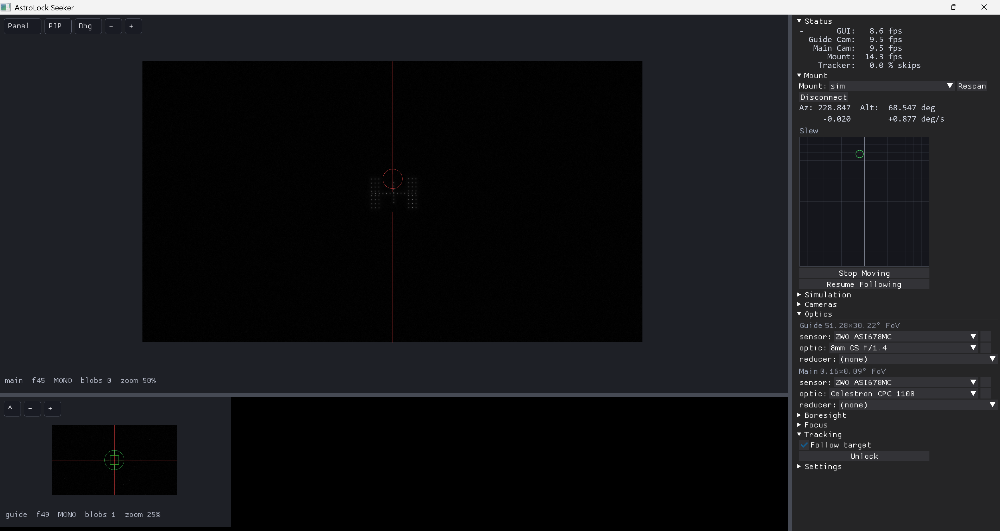
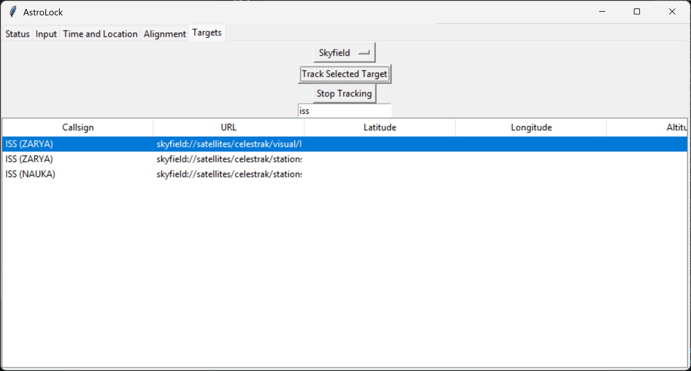

# AstroLock



This software helps you aim a telescope with a motorized mount, particularly at moving targets like satellites, rockets, or planes.

The newest, largest part, AstroLock Seeker, is designed to use a guide camera (mounted alongside the telescope) to acquire and track targets, even if the target motion is unknown and the telescope is not aligned.  It has a GUI that lets you do every step of this process, including recording from the main camera.  The goal is to make this as automatic as possible.

There's also an older GUI (Astrolock Classic), which is more focused on aligning the telescope to known stars, and tracking satellites with a known TLE, and allowing the user to fine-tune the tracking using a finderscope and a joystick.  I'm no longer actively developing this, but eventually its alignment features may be subsumed into Seeker.

There's also a utility to help with collimating and focusing, focus.py.  This will also probably be subsumed into Seeker soon.

## Hardware

Astrolock can currently talk to Celestron NexStar hand controllers that control AltAz mounted telescopes.  (I'm using it with a Celestron CPC1100.)  It should be fairly easy to support EQ mounts, or to expand to other mount protocols - all that's needed is the ability to set the rates that each axis should move at, and to read the current position.

For cameras, Astrolock currently supports Zwo ASI cameras.  (Webcam support coming soon.)

## Installation

Astrolock is a Python project.  These steps get you running in simulation with no hardware; see [Hardware](#hardware) for the extra bits you'll need at the scope.

1. **Clone the repo:**

    ```
    git clone https://github.com/tomfelker/astrolock.git
    cd astrolock
    ```

2. **(Optional but recommended) Create and activate a virtual environment**, so Astrolock's dependencies don't collide with anything else:

    ```
    python -m venv .venv
    # Windows (PowerShell):
    .venv\Scripts\Activate.ps1
    # Linux / macOS:
    source .venv/bin/activate
    ```

3. **Install PyTorch.**  This is done separately from the other dependencies, because the right command depends on your OS and whether you have a CUDA GPU.  Grab the command from the [PyTorch install selector](https://pytorch.org/get-started/locally/) — it'll look something like this for Windows with an nVidia GPU:

    ```
    pip3 install torch torchvision --index-url https://download.pytorch.org/whl/cu132
    ```

    A GPU is strongly recommended, but CPU-only torch will also work (just install the CPU wheel from the selector).

4. **Install the remaining dependencies:**

    ```
    pip install -r requirements.txt
    ```

5. **Install camera drivers** (only needed for real hardware — skip this if you're just running in simulation).  The `zwoasi` Python package is just a wrapper; it needs ZWO's native SDK library (`ASICamera2.dll` on Windows, the equivalent `.so`/`.dylib` elsewhere) at runtime.  The easiest way to get it is to install [ASIStudio](https://www.zwoastro.com/software/), which Astrolock finds automatically at its default path.  Otherwise, download the SDK from ZWO and set the `ZWO_ASI_LIB` environment variable to the full path of the library.

### To run

Activate your venv (if you made one - see above), then from the repo root:

```
python -m astrolock.seeker.backend
```

This starts Astrolock Seeker in simulation mode — see the [Quick Start](#astrolock-seeker-quick-start) below.

## Astrolock Seeker Quick Start

1. Connect your mount and cameras to the computer via USB.  (Cameras should have as much bandwidth as possible, so ideally don't use a hub and use the fastest ports for them.)

1. Run the software (see above).  It currently starts in simulation mode, connected to a simulated mount and simulated cameras that are showing a simulated ISS pass.  You can experiment with this, or turn it off by clicking Disconnect on the Mount and both Camera settings groups on the left.

1. Make sure the telescope is pointed exactly at the horizon (zero altitude), and then turn it on.  Even though we don't handle alignment, it's important that we know where the gimbal lock is.  If you're using an equatorial mount, point it along the ecliptic plane (zero declination).

1. Under Mount, select your mount from the dropdown and click Connect.  To test it, you can click in the Slew rate indicator, and the mount should move accordingly.

1. Under Cameras/Guide Camera, select the camera you'll be using for guiding the scope.  For tracking satellites, this should be a fairly wide angle setup (enough that you'll have no problem getting the target into this camera's view).  Click Connect.

1. Under Cameras/Main Camera, select the camera you've connected to your telescope.  (This is optional - you might also just observe visually, or handle this camera yourself.  But if you do set one up, Seeker will record for you, and - once the target settles into this camera's much narrower field - hand tracking off to it for a tighter lock.)

1. Under Optics, select which lenses you've attached to your cameras, and make sure the sensors were detected correctly.  It's important to get this right, so Seeker knows the FoVs of the cameras and can accurately respond when they're off center.

1. Focus and aim your setup so the guide camera can see some stars.  You may want to uncheck "Auto Record" for your cameras.  Click on one of those stars, and the telescope should slew to it and track it.  Now, under Boresight, adjust it so that the main camera (or your optical view) is also centered on the star.

1. Coming soon - Focus tab.

1. In the Tracking tab, uncheck "Follow Target", to go back into acquisition mode, and make sure the guide camera view is back in the main pane.  (If it's below in the PIP pane, click the `[^]` button.)  You should now see yellow and green boxes around potential targets.

1. Make sure "Auto Record" is checked for your camera.

1. Wait for your satellite pass!  When you see it in the guide camera, click it, and Seeker will automatically start recording and track the target.  As long as "Record" is checked, your .SER files are being saved (in `sessions/<timestamp>/*.ser`).

1. Once the mount has centered the target and it drifts into the main camera's field, tracking automatically hands off to the main camera.

1. Save your settings in the Settings tab, to make it easier for next time.

For design, internals, and roadmap: see [astrolock_seeker.md](docs/astrolock_seeker.md).


## Astrolock Classic Quick Start



1. Connect everything up: Telescope on, telescope connected to hand controller, hand controller connected to PC via USB, and gamepad connected to PC.

1. Run AstroLock.

1. Under the Status tab, select `celestron_nexstar_hc:COM`n (it should auto-detect) from the dropdown and hit Start.  You should see a bunch of info below.

1. Play around with using the gamepad to move the telescope - see below for details.  Right trigger or Start will stop any motion.

1. Go to the Time and Location tab, and check that everything looks right.  If your telescope has GPS, it should have grabbed that (or you can kick it to try again), otherwise you can enter your own coordinates or your address.

1. Go to the Alignment tab to start aligning the telescope.  Use your gamepad to point at a target, and once it's centered in your eyepiece or camera, press "Add Current Observation" (or press Cross on the gamepad).  Repeat this three or more times.  Now press "Perform Alignment" - after a few seconds, it should give you a solution, including identifying the targets you used and telling you how level your tripod was.

1. Once you're aligned, you can track targets!  Go to the Targets tab and find what you're interested in, double-click, and the telescope should slew to the target and begin tracking it.  You can now fine-tune using the joysticks.

This 'classic' UI is deprecated, and eventually will get its functionality folded into Seeker, but for now, see [astrolock_classic.md](docs/astrolock_classic.md) for more.

# License

 This program is free software: you can redistribute it and/or modify
 it under the terms of the GNU General Public License as published by
 the Free Software Foundation, either version 3 of the License, or
 (at your option) any later version.